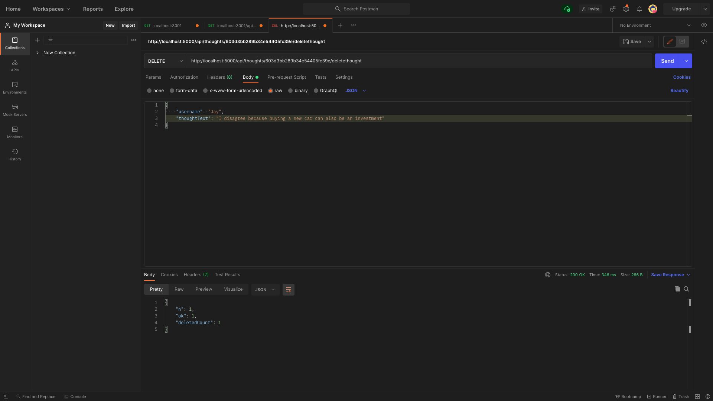
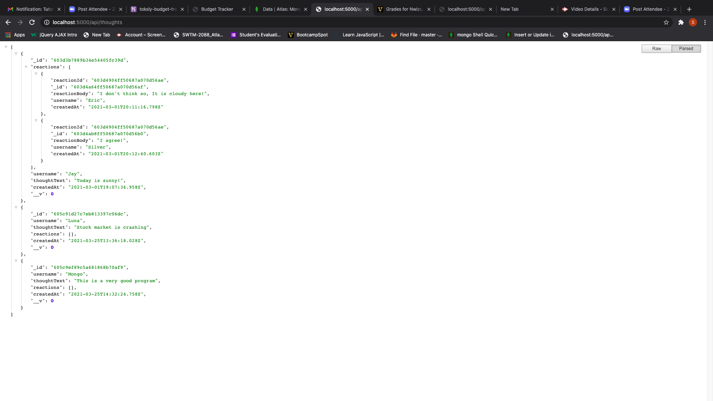

# social-network-api
<strong>social-network-api</strong>
The name of this application is <i> social-network-api</i> it is designed  for routing, a MongoDB database, and the Mongoose ODM.
<strong>Image</strong>
 

video link  https://drive.google.com/file/d/1QfvbWo37IGnoM-3zD_C1Q6B-VLqjpC-y/view
https://drive.google.com/file/d/1MkoRy2MzUtwL3r8uJoVtS4h2d7gyXdVd/view

<strong>Description</strong>
This application allows its users to be able to create new users, update, and delete users. It also allows for posting, updating, deleting of thoughts and reactions by users. A user or a thought can be updated or deleted using an id, but creating a new user or thought doesn't require an id.
<strong>Technology used</strong>
 Javascript, mongodb, mongoose, and node.js. 

<strong>Installation</strong>

This project does not need any installation,rather its working is  explained using a walkthrough video
<strong>Usage</strong>

The application is easy to use. It gives the users the ability to post, update, and delete

<strong>Support and Contribution</strong>
If you have any question please email me at nwizutoks@gmail.com

